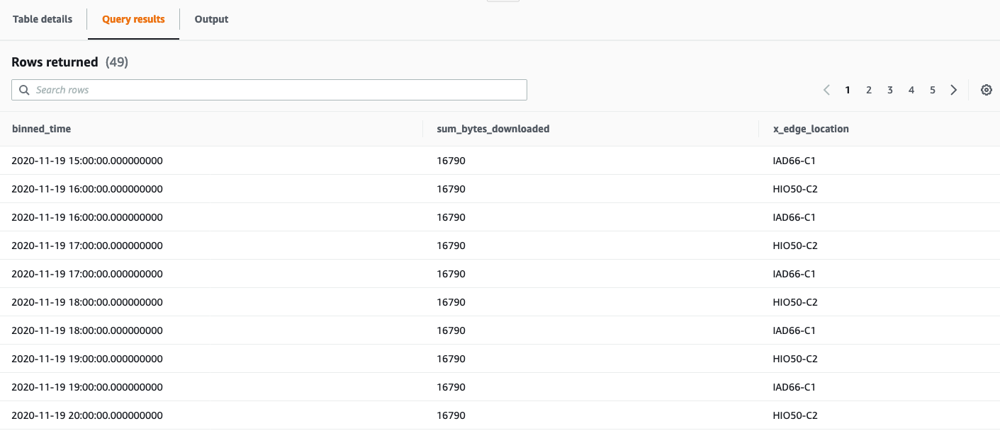

# CloudFront Real-Time Monitoring Solution
[CloudFront real-time logs](https://docs.aws.amazon.com/AmazonCloudFront/latest/DeveloperGuide/real-time-logs.html) enables developers to analyze, monitor, and take action based on content delivery performance. This project provides a serverless solution for processing these logs in real-time to generate custom metrics for real-time dashboards and alerting. This solution may be especially useful to customers that do not have an existing client telemetry solution or may not have the ability to configure data collection on the client and want to analyze CloudFront performance in real-time. This solution is also useful for customers that want to analyze CloudFront performance metrics with more granularity (i.e. per country, URI, edge location and more) than is provided by the default CloudWatch metrics that are provided as metrics aggregated for the entire Distribution.

This project provides a serverless solution to begin processing CloudFront real-time log data in seconds and makes it easy to manage without the need to provision complex infrastructure. The solution creates a CloudFront Real-Time Logs configuration that you can attach to your existing CloudFront Distribution(s). Once attached to your distribution, the log configuration begins sending request log records to a Kinesis Data Stream using a configurable sampling rate. The solution deploys AWS Lambda to process the real-time logs from the stream and convert them into time-series records that are ingested into [Amazon Timestream](https://aws.amazon.com/timestream/), a scalable and serverless time-series database. Timestream provides a cost-effective solution for storing and analyzing this type of time-series data with flexible storage tiering, a query engine that supports SQL, and integration with a variety of popular AWS and open-source tools, including [Amazon QuickSight](https://aws.amazon.com/quicksight/), [Grafana](https://grafana.com/) and more.

## Features

* Provides an easy to use integration for monitoring existing CloudFront Distributions
* Built using the AWS Serverless Application Model (AWS SAM) to make it easy to manage the solution using infrastructure as code
* Solution enables operators to monitor metrics with rich high-cardinality metadata by ingestinig the log records as measures and dimensions into time-series database.
* Can be easily extended with custom tools to monitor the metrics using the AWS SDK, JDBC connector, or with flexible set of open-source integrations.

## Architecture


## AWS Services

- Amazon CloudFront (does not deploy CloudFront distribution, configures an existing distribution)
- AWS Lambda
- Amazon Kinesis Data Streams
- Amazon Timestream
- AWS Serverless Application Model (AWS SAM)

### Real-time data processing
Each CloudFront Real-time log record received by the solution's Lambda function is processed and  ingested into Amazon Timestream as a data record. The Lambda Function performs the following processing steps for each record:

* Convert each real-time log record from tab-delimited format to structured JSON format
* The name of each field in the source log record is kept the same when ingested into Timestream. However, Lambda converts dashes (`-`) into underscores (`_`) to conform to Timestream's field name requirements.
* Each field is loaded into Timestream as a **Dimension**. The `sc_bytes` field is loaded into Timestream as a **Measure** (integer).
* The headers (`cs_headers`) and header names (`cs_header_names`) are removed before the record is written to Timestream. Due to the potential size and number of headers, these fields are removed to reduce costs. The Python code in the Lambda function includes commented code that can be modified if these fields are desired.

## Getting Started

This solution is deployed using the AWS Serverless Application Model (AWS SAM). AWS SAM is an open-source framework that makes it easy to build serverless applications on AWS and provides a template specification that is built on top of AWS CloudFormation.

### Pre-requisites

- [AWS SAM CLI](https://docs.aws.amazon.com/serverless-application-model/latest/developerguide/serverless-sam-cli-install.html)

Note that Docker is also required to use AWS SAM CLI and is included in the above steps. After installation, make sure Docker is running on your local machine before proceeding.

### Clone the repository
#### Clone with SSH
```bash
git clone git@github.com:aws-samples/aws-cloudfront-realtime-monitoring.git
```

#### Clone with HTTPS
```
git clone https://github.com/aws-samples/aws-cloudfront-realtime-monitoring.git
```

### Build
The AWS SAM CLI provides the necessary components to build the dependencies for the Python Lambda Functions defined in this solution using the *sam build* command. It also copies the source code into local staging folders under *.aws-sam/build* before it zips and uploads the function source to Amazon S3.

Navigate to the cloned folder:

```bash
cd aws-cloudfront-realtime-monitoring
```

Build the serverless application using AWS SAM:

```bash
sam build --use-container
```

> **Note:** Using the ```--use-container``` flag informs the SAM CLI to build your Lambda Function inside of a local Docker container using the language runtime that is defined for the Lambda function(s) in the template. This helps prevent issues that may occur from building the functions using a local version of Python on your local machine that is different than the runtime Lambda uses to execute your function in AWS. This process may take a few minutes to execute because the appropriate Docker Image(s) need to be pulled to your local machine to execute the build.

### Deploy
When you initially deploy the SAM template, be sure to use the ```--guided``` flag as shown below which generates a local configuration file *samconfig.toml* for your SAM project.  This file is ignored by the included *.gitignore*. Future deployments can use the simplified `sam deploy` command which will use the generated configuration file *samconfig.toml*.

```bash
sam deploy --guided
```

Follow the guided steps to deploy the stack, including creating an S3 Bucket for the build artifacts to be stored in the cloud. Instructions for this process can be found [here](https://docs.aws.amazon.com/serverless-application-model/latest/developerguide/serverless-deploying.html).

**CloudFormation Stack Parameters**:

- **KinesisStreamShards**: Integer value representing the number of shards to provision for the deployed Kinesis Data Stream. Defaults to `1`. Instructions are provided in the [CloudFront documentation](https://docs.aws.amazon.com/AmazonCloudFront/latest/DeveloperGuide/real-time-logs.html#understand-real-time-log-config-endpoint) for estimating the number of shards needed for a deployment.

- **RealtimeLogsSamplingPercentage**: Integer value between 1-100 that represents the percentage of viewer requests to CloudFront to sample for generating realtime log records. Defaults to `5` (5%). This value is used when CloudFormation creates the Realtime Log Configuration.

Navigate to the AWS CloudFormation console and review the stack resources that were created for you. 

## Attach the log configuration to your CloudFront Distribution(s)

When the solution is deployed, it creates a new CloudFront Realtime Logs Configuration but it does not automatically associate this log configuration with your CloudFront Distribution(s). You can attach this configuration to your CloudFront Distribution by navigating to the CloudFront Realtime Logs [console](https://console.aws.amazon.com/cloudfront/v2/home#/logs/realtime), and associating the configuration with your distribution using the **Attach to distribution** option. Once the real-time configuration is attached to your distribution with a status of **Deployed**, then you can then begin analyzing your metrics in Timestream.

## Query your metrics with Amazon Timestream

Once the solution is deployed and you have attached your distribution to the Real-time log configuration, you should be able to start querying your metrics in Amazon Timestream. Navigate to [Amazon Timestream](https://console.aws.amazon.com/timestream/home) query editor, or use the query editor link provided in the CloudFormation Outputs.

**Example Query**: Hourly sum of downloaded bytes by edge location over 24 hours

You can copy the below query into the query editor and select **Run**. Be sure to replace the database and table values with your own in the `FROM` clause.

```
-- Get the sum of bytes downloaded by hour for each CloudFront Edge Location over the last 24 hours
SELECT 
    bin(time, 1h) as binned_time,
    SUM(
      CASE WHEN measure_name = 'sc_bytes' THEN measure_value::bigint ELSE NULL END 
    ) AS sum_bytes_downloaded,
    "x_edge_location"
FROM "<TIMESTREAM DATABASE NAME>"."<TIMESTREAM TABLE NAME>"
WHERE time >= ago(24h)
AND measure_name IN ('sc_bytes')
GROUP BY "x_edge_location", bin(time, 1h)
ORDER by binned_time, "x_edge_location"
```

The query should return results similar to below:



## Monitor with Grafana (Optional)
Grafana is a popular open-source tool for analytics and monitoring and can be easily installed on your local machine, or hosted as a server in AWS. Amazon Timestream is [integrated with Grafana as a plugin](https://docs.aws.amazon.com/timestream/latest/developerguide/Grafana.html). 

1. Follow the [Grafana instructions](https://grafana.com/docs/grafana/latest/installation/) to install it on your local machine (you can skip this setup if you already have a Grafana deployment).
2. Install the [Grafana Plugin for Amazon Timestream](https://grafana.com/grafana/plugins/grafana-timestream-datasource) so that the tool can extract time-series metrics as a data source.
3. Once you have downloaded and configured Grafana, you can begin developing queries and graphing metrics. Below is an example query configuration that you can use to graph the bytes downloaded by edge location:
	
	
	```
	SELECT 
    x_edge_location, 
    CREATE_TIME_SERIES(time, measure_value::bigint) as edge_location
	FROM "$__database"."$__table"
	WHERE $__timeFilter
	    AND measure_name = '$__measure'
	GROUP BY x_edge_location
	```
4. Once saved, you can add this to a Grafana dashboard as a `Graph` visualization type as shown below:
	

	> Note: Your graph will probably look more exciting than this example. This is a simple example of a single small file that is being downloaded by clients.

## Customize the solution (optional)

### Modify the CloudFront Realtime Log fields

This section includes instructions for modifying the fields that are included in Realtime logs and processed by the solution.

CloudFront delivers real-time logs to Amazon Kinesis with fields presented in a specific pre-defined order as defined in the CloudFront documentation. Therefore, the solution's log processor Lambda function must be configured properly beforehand in order to process the specified fields in the order they are delivered by CloudFront. By default, this solution is configured to ingest all of CloudFront's available real-time fields. To further reduce costs and minimize the amount of log data stored by the solution, you can modify the fields that are included in CloudFront Realtime logs by following the below steps:

<details><summary>Expand this section to modify the solution to add or remove log fields from the solution configuration - Click to expand (optional)</summary>

**Step 1. Modify the SAM template** 

The CloudFront Realtime Logs Configuration is managed as a resource defined in the solution's AWS SAM template using the [AWS::CloudFront::RealtimeLogConfig](https://docs.aws.amazon.com/AWSCloudFormation/latest/UserGuide/aws-resource-cloudfront-realtimelogconfig.html) resource type. In order to modify the log configuration used in the solution, perform the following steps:

- Open the solution CloudFormation template located at ```./template.yaml```.
- In the template, modify the **Fields** defined in the CloudFront Realtime Logs Configuration **CloudFrontRealtimeLogConfig** as needed.

**Step 2: Modify the log processor Lambda function**

CloudFront does not include field headers/names in the logs that are delivered to Kinesis. Therefore the Lambda log processor function must be pre-configured to properly parse the order of the fields and their data types. The solution includes a JSON configuration file that is packaged alongside the Lambda function source code that defines each of the available Realtime log fields and a data mapping for the field. This data mapping is used by Lambda to process the field in the absence of field headers/names. Perform the following steps to update the function configuration:

- Open the field mapping configuration file located at ```./log-processor/config/cf_realtime_log_field_mappings.json```. This file contains a mapping of all available CloudFront realtime log fields and the data type that should be used to process the field. 
- Confirm that any fields you added to the CloudFront Realtime Configuration in Step 1 are defined in this JSON config with a data type, otherwise the Lambda function will not be able to process the field. It is possible that CloudFront may add additional log fields in the future. If so, before you will be able to use those new fields you will need to define those fields and data types in this configuration file.

Use this opportunity to make any other processing changes to the code as you like.

**Step 2: Build/Deploy the SAM template**

Once you have made these changes you can execute ```sam build --use-container && sam deploy``` to deploy your modified version of the solution to AWS. These two commands will build, package and deploy the solution's Lambda functions and other AWS resources as a CloudFormation stack.

**Step 3: Modify the fields in the CloudFront real-time logs configuration**

Once you have deployed the modified solution, you can attach your Realtime Log Configuration to one or more of your CloudFront Distributions in order to generate real-time metrics.

</details>

After you have setup the real-time logs configuration for your CloudFront distribution, follow the steps in the below section to monitor your custom metrics.

## Troubleshooting

If you encounter any issues or are not receiving data in Timestream, you can use CloudWatch Logs to investigate any processing issues with the solution's Lambda Function. The **LogProcessor** Lambda Function generates logs that are stored in Amazon CloudWatch. The log group can be found in the Outputs tab of the CloudFormation Stack.  

## Contributing

See [CONTRIBUTING](CONTRIBUTING.md) for more information.

## Frequently Asked Questions (FAQ)

### 1) Should I use CloudFront Real-time or Standard Logs?
CloudFront provides two forms of logging, including real-time logs which are delivered to Amazon Kinesis within seconds of a request, and [standard logs (access logs)](https://docs.aws.amazon.com/AmazonCloudFront/latest/DeveloperGuide/AccessLogs.html) which are delivered in batch periodically to an Amazon S3 bucket. Depending on your requirements you may want to use one or both of these logging solutions. This project provides an easy way for developers to generate their own customized metrics from their CloudFront logs when insights are needed within seconds as opposed to hours or days. This solution may also be useful if you require metrics at a more granular level than the default Distribution-wide metrics from CloudFront. For example, this solution can be used to analyze performance based on the end user's location or the specific edge location that served the request. This solution makes a trade off of precision/accuracy in favor of performance, and uses log sampling to reduce costs. If you do not need real-time visibility into performance of CloudFront Distributions and require a reporting or ad-hoc analytics solution, then it is recommended to use CloudFront Standard Logs. You can also adjust the sampling rate depending as required.

### 2) How can I update the solution?
Due to the fact that CloudFront Realtime Log fields are strictly ordered but do not include self-defining header names, this solution treats a Realtime Log Configuration, Kinesis Stream, and Lambda Function as a tightly coupled single unit of deployment for the purposes of infrastructure management. If you intend to make any additions/removals to the CloudFront Realtime Log fields in a previously deployed stack, it is recommended to deploy those changes as a new separate CloudFormation stack, which will result in a new Timestream database and table that is used for that stack's time-series metrics. This recommendation will help avoid undesirable behaviors such as multiple log records in a Kinesis batch that have different fields which may result in processing errors in the function. Once the new stack is deployed you can attach it your CloudFront Distribution and detach the old real-time configuration, then delete the old stack. Due to the fact that each stack publishes metrics to its own Timestream database table, metrics should remain accurate during a migration and this process should enable you to perform a "blue/green" deployment strategy for changes to your real-time monitoring solution.

### 3) What is the estimated cost of using this solution? 

The cost of running this solution will depend on the amount of log records that are ingested from CloudFront, the number of fields included in those records, and whether or not you make any customizations to the data that is loaded into Amazon Timestream. The cost will also depend on how frequently you query the data in Timestream. 

**Solution default settings:**

* Lambda max batch size: `1000`
* Kinesis Data Stream Shards: `1`
* Timestream writes per batch: `100`
* CloudFront Real-time Log Fields: `All` (as of Nov 2020)
* CloudFront Real-time Log Sampling Rate: `5%`

The [documentation](https://docs.aws.amazon.com/AmazonCloudFront/latest/DeveloperGuide/real-time-logs.html) for CloudFront Realtime logs includes a calculation for determining the number of shards needed for Kinesis Streams which will help you estimate the cost of Kinesis. Additionally, when estimating costs for deploying this solution, you should also account for costs associated with AWS Lambda and Amazon Timestream. Each CloudFront realtime log record that is ingested into the solution's Kinesis Data Stream is consumed by AWS Lambda and ingested into Amazon Timestream. To reduce costs it is recommended to configure a low CloudFront Realtime log sampling rate which is configurable as a parameter in the CloudFormation template (defaults to 5%). It is also recommended to reduce any unnecessary fields from the realtime log configuration to reduce the amount of data that is ingested into the solution. See the section on customizing the solution to modify the fields.

## License

This library is licensed under the MIT-0 License. See the LICENSE file.